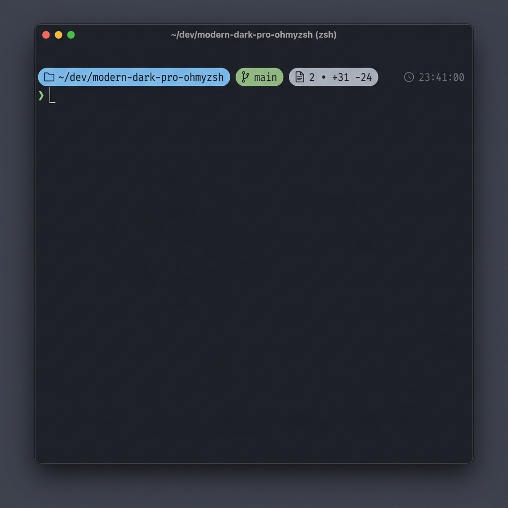
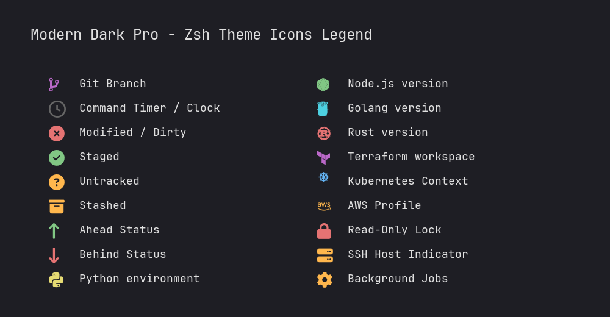

# 🎨 Modern Dark Pro Capsule - Oh My Zsh Theme

A premium, modern, and dark-mode-optimized Oh My Zsh theme featuring capsule/pill-shaped status segments, inspired by the [Modern Dark Pro](https://github.com/dvigo/modern-dark-pro) color palettes.

Designed for developers who appreciate clean typography, high readability, and fast execution times, this theme wraps your terminal state segments (directory, git branch, changes) in sleek capsule containers.

---

## 📸 Preview


---

## ✨ Features

- **🚀 Dual Variant Support**: Switch between **Night** (pastel tones, soft black) and **Monokai** (vibrant classic Monokai, warm black) to match your editor theme.
- **📁 Smart Path Display**: Shows the working directory cleanly with rich color contrast inside a capsule.
- **🎋 Complete Git Status**:
  - Displays branch name in its own capsule.
  - Interactive status badges: Modified, Staged, Untracked, Stashed. Separated with generous spacing for maximum legibility.
  - Sync status with remote: Ahead and Behind indicators.
- **⏱️ Execution Timer**: Tracks command duration and prints it (e.g., ` 2.5s`) inside a capsule if it takes longer than 2 seconds (configurable).
- **🕒 System Clock**: Displays the current system time (`HH:MM:SS`) aligned perfectly and out of the way.
- **🐍 Python virtualenv / Conda**: Displays active virtual environments with a custom logo (``) in a capsule.
- **🔒 Read-only Lock**: Displays a lock icon (``) inside the path capsule if you navigate into a folder where you don't have write permissions.
- **⚙️ Background Jobs**: Displays a gear icon (`⚙`) followed by the count of running background jobs in your session inside a capsule.
- ** SSH Indicator**: Displays ` username@host` in a capsule if you are logged in over SSH.
- **🟢 Status Feedback**: The prompt symbol (`❯`) turns green on success and red on failure to indicate the command's exit code.
- **⚡ Super Lightweight**: Highly optimized Git status parsing and shell hook code to prevent terminal latency.

---

## 📦 Installation

### Prerequisites
- **Oh My Zsh** must be installed. If not, install it via:
  ```bash
  sh -c "$(curl -fsSL https://raw.githubusercontent.com/ohmyzsh/ohmyzsh/master/tools/install.sh)"
  ```

### Step 1: Clone the repository
Clone this project into a local folder:
```bash
git clone https://github.com/dvigo/modern-dark-pro-capsule-ohmyzsh.git ~/dev/modern-dark-pro-capsule-ohmyzsh
```

### Step 2: Run the installer
Run the provided installer script, which creates a symlink to your Oh My Zsh custom themes folder:
```bash
cd ~/dev/modern-dark-pro-capsule-ohmyzsh
./install.sh
```

### Step 3: Configure your `~/.zshrc`
Open your `~/.zshrc` and change the `ZSH_THEME` setting:
```bash
ZSH_THEME="modern-dark-pro-capsule"
```

Reload your terminal:
```bash
source ~/.zshrc
```

---

## ⚙️ Customization & Configuration

You can customize the theme behavior by exporting variables in your `~/.zshrc` file **before** the line where Oh My Zsh is sourced (`source $ZSH/oh-my-zsh.sh`).

### 1. Theme Variant
Choose between the two color variants:
```bash
# Options: "night" (default) or "monokai"
export MODERN_DARK_PRO_VARIANT="night"
```

### 2. Developer Icons (Nerd Fonts)
The theme defaults to `true` to display icons out of the box. You can manually configure this setting:
```bash
# Enable Nerd Fonts (default: true). Set to false to disable icons.
export MODERN_DARK_PRO_NERD_FONTS=true
```

> [!NOTE]
> Nerd Font glyphs may render as empty boxes or broken characters in your web browser if you do not have a Nerd Font installed and configured in your browser. Refer to the [Visual Symbols Legend](#🖼️-visual-symbols-legend) image below to see exactly how they look in a terminal.

| Indicator | Nerd Fonts Symbol Name | Standard Unicode (Default) |
| :--- | :--- | :--- |
| **Directory** | Folder Outline (``) | `📁` |
| **Git Branch** | Git Branch (``) | `⌥` |
| **Command Timer / Clock** | Clock (``) | `🕒` |
| **Modified / Dirty** | Solid Times Circle (``) | `✗` |
| **Staged** | Solid Check Circle (``) | `●` |
| **Untracked** | Solid Question Circle (``) | `?` |
| **Stashed** | Archive Box (``) | `⚑` |
| **Ahead** | Up Arrow (``) | `⇡` |
| **Behind** | Down Arrow (``) | `⇣` |
| **Python environment** | Python Logo (``) | `py` |
| **Node.js version** | Node.js Logo (``) | `node` |
| **Golang version** | Go Logo (``) | `go` |
| **Rust version** | Rust Logo (``) | `rust` |
| **Terraform workspace** | Terraform Logo (`󱁢`) | `tf` |
| **Kubernetes Context** | Kubernetes Logo (`☸`) | `k8s` |
| **AWS Profile** | AWS Logo (``) | `aws` |
| **Read-Only Lock** | Lock (``) | `🔒` |
| **SSH Host** | Server (``) | `ssh` |
| **Background Jobs** | Gear (``) | `⚙` |

### 🖼️ Visual Symbols Legend
If you don't have a Nerd Font installed locally on your browser or editor, here is how the icons look in your terminal:




### 3. Container Style (`MODERN_DARK_PRO_PILL_STYLE`)
Choose how your capsule segments are wrapped:
- `bracket` (default): Outlines each segment in thin bordered brackets, e.g. `[ 📁 path ]`.
- `round`: Renders solid-background capsules with Powerline rounded caps (`` and ``).
- `none`: Disables capsules, showing flat text.

```bash
# Options: "bracket" (default), "round", "none"
export MODERN_DARK_PRO_PILL_STYLE="bracket"
```

### 4. Capsule Color Style (`MODERN_DARK_PRO_PILL_COLOR_STYLE`)
Choose the coloring method for the solid rounded capsules (only applies if `MODERN_DARK_PRO_PILL_STYLE` is set to `round`):
- `solid` (default): Uses each segment's thematic color as the solid background and renders the text inside in high-contrast dark gray.
- `dark`: Uses a fixed dark gray background (`#282828`) for all capsules and keeps the text inside colored.

```bash
# Options: "solid" (default), "dark"
export MODERN_DARK_PRO_PILL_COLOR_STYLE="solid"
```

### 5. Prompt Layout (`MODERN_DARK_PRO_PROMPT_LAYOUT`)
Choose how the prompt layout is structured:
- `two-line` (default): Capsules and clock on line 1, input prompt character (`❯`) on line 2. Keeps your input space clean and roomy.
- `single`: All capsules and prompt character (`❯`) on a single line.
- `classic`: Wraps segments in capsules but connects them to the prompt character using the classic connecting lines (`┌─` and `└─`).

```bash
# Options: "two-line" (default), "single", "classic"
export MODERN_DARK_PRO_PROMPT_LAYOUT="two-line"
```

### 6. Clock Toggle (`MODERN_DARK_PRO_SHOW_CLOCK`)
Toggle the right-aligned clock:
```bash
# Options: true (default) or false
export MODERN_DARK_PRO_SHOW_CLOCK=true
```

### 7. Custom Symbols
You can customize the prompt characters or icons manually in your `~/.zshrc`:
```bash
# Custom primary prompt symbol (default: ❯)
export MODERN_DARK_PRO_CHAR="❯"

# Custom Git branch icon (overrides Nerd Font defaults)
export MODERN_DARK_PRO_GIT_SYMBOL=""
```

### 8. Command Timer Options
You can toggle the timer or change the minimum threshold in seconds:
```bash
# Toggle showing command execution duration (default: true)
export MODERN_DARK_PRO_SHOW_EXEC_TIME=true

# Show timer only for commands that take more than X seconds (default: 2)
export MODERN_DARK_PRO_EXEC_TIME_MIN=3
```

### 9. Directory Path Styles
You can customize how the working directory is displayed and shortened in your prompt:
```bash
# Choose path display style: 'limit' (default), 'shrink', or 'full'
# - 'shrink': Shrinks parent folders to 1 letter, e.g., ~/d/p/modern-dark-pro-ohmyzsh
# - 'limit': Shows only the last N directories, e.g., .../proyectos/modern-dark-pro-ohmyzsh
# - 'full': Shows the full directory path, e.g., ~/dev/proyectos/modern-dark-pro-ohmyzsh
export MODERN_DARK_PRO_PATH_STYLE="limit"

# Depth level (used only if style is set to 'limit') (default: 3)
export MODERN_DARK_PRO_PATH_DEPTH=3
```

---

## 🎨 Color Palettes

### Night Variant (Default)
Soft, elegant pastel colors optimized for modern OLED and dark displays.
- **Directory**: `#64b5f6` (Light Blue)
- **Git Branch**: `#81c784` (Soft Green)
- **Success/Staged**: `#81c784` (Soft Green)
- **Warning/Untracked**: `#ffb74d` (Soft Orange)
- **Error/Dirty**: `#e57373` (Soft Red)

### Monokai Variant
The classic high-contrast Monokai theme colors adapted for terminal use.
- **Directory**: `#66d9ef` (Monokai Blue)
- **Git Branch**: `#a6e22e` (Monokai Green)
- **Success/Staged**: `#a6e22e` (Monokai Green)
- **Warning/Untracked**: `#e6db74` (Monokai Yellow)
- **Error/Dirty**: `#f92672` (Monokai Red)

---

## 📄 License

This project is licensed under the MIT License - see the [LICENSE](LICENSE) file for details.
